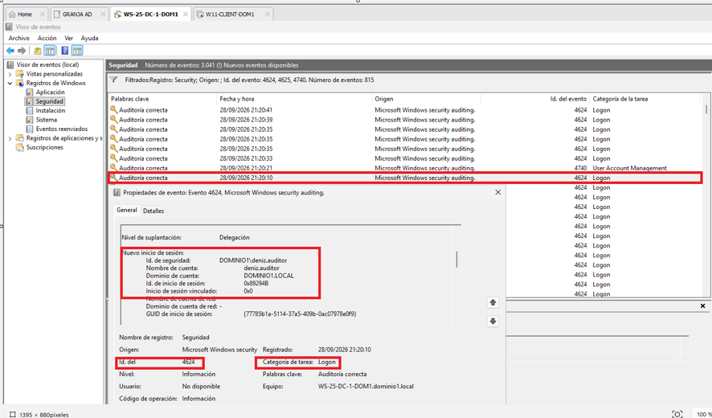
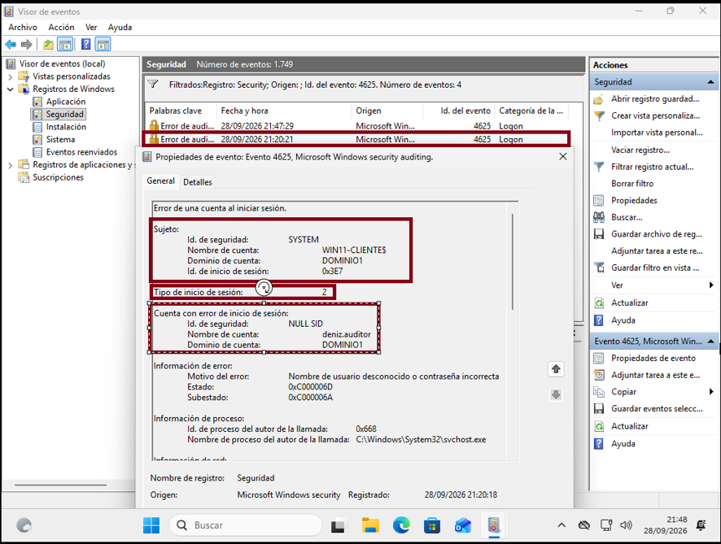
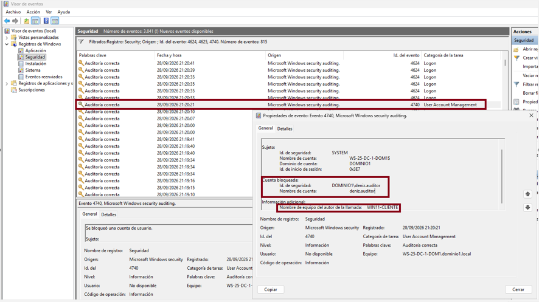
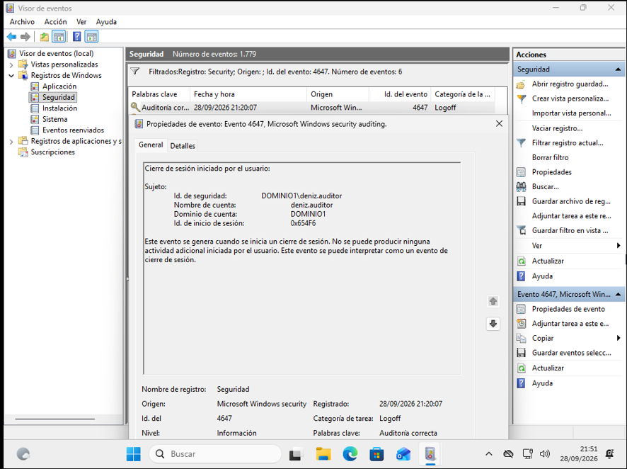

# 🏢 Fundamentos de Seguridad en Windows Server y Active Directory

## 🎯 Objetivo del Laboratorio
El propósito de esta práctica es analizar la administración de identidades, la aplicación de directivas de grupo (GPO) y la monitorización de eventos de seguridad en un entorno de Directorio Activo (AD DS). El ejercicio está orientado hacia el análisis defensivo (Blue Team) y la operativa de un perfil SOC Junior, evaluando cómo se auditan los inicios de sesión, las anomalías de autenticación y los bloqueos preventivos.

## 🖥️ Entorno y Máquinas Implicadas
* **Controlador de Dominio (DC):** Windows Server (`WS-25-DC-1-DOM1.dominio1.local`) con rol Active Directory Domain Services.
* **Equipo Cliente:** Windows 11 Pro (`WIN11-CLIENTE`) unido al dominio corporativo `DOMINIO1`.
* **Segmento de Red:** Red privada local aislada mediante adaptador virtual (Host-Only).
* **Aviso de Entorno Controlado:** Todas las pruebas, políticas y eventos documentados en este proyecto han sido ejecutados exclusivamente dentro de un entorno virtualizado local, controlado y debidamente autorizado con fines académicos y de formación técnica.

---

## ⚙️ 1. Configuración Realizada

1. **Estructura Lógica en Active Directory:**
   * Creación de la Unidad Organizativa: `OU=Seguridad_Lab,DC=dominio1,DC=local`.
   * Alta de cuenta de usuario estándar: `deniz.auditor`.
   * Creación de grupo de seguridad de ámbito global: `Sec-Auditores`, vinculando al usuario como miembro.

2. **Directiva de Bloqueo de Cuentas (GPO):**
   Configurada a través de la *Default Domain Policy* en `gpmc.msc`:
   * **Umbral de bloqueo (*Account lockout threshold*):** 3 intentos fallidos de autenticación.
   * **Duración del bloqueo (*Account lockout duration*):** 15 minutos.
   * **Restablecer el contador tras:** 15 minutos.
   * Aplicación forzada en los clientes mediante el comando `gpupdate /force`.

---

## 🔍 2. Eventos Generados y Ubicación en el Sistema

Los eventos de seguridad se auditan en el registro del sistema operativo:
> **Ubicación:** `Visor de eventos (eventvwr.msc) -> Registros de Windows -> Seguridad` (`Security.evtx`)

| Event ID | Registro / Denominación | Ubicación Observada | Causa Disparadora | Códigos Clave Identificados |
| :---: | :--- | :--- | :--- | :--- |
| **`4624`** | Inicio de sesión correcto (*Logon*) | Servidor DC y Cliente | Autenticación válida con credenciales correctas. | `LogonType: 2` (Interactivo local). |
| **`4625`** | Inicio de sesión fallido (*Failed Logon*) | Endpoint (`WIN11-CLIENTE`) | Introducción intencionada de 3 contraseñas erróneas. | `Status: 0xC000006D` / `Substatus: 0xC000006A` (Clave errónea). |
| **`4740`** | Cuenta bloqueada (*User Account Management*) | Servidor DC (`WS-25-DC-1-DOM1`) | Superación del umbral de 3 fallos consecutivos. | Sujeto: `SYSTEM` (`WS-25-DC-1-DOM1$`), Caller: `WIN11-CLIENTE`. |
| **`4647`** | Cierre de sesión voluntario (*Logoff*) | Endpoint (`WIN11-CLIENTE`) | El usuario seleccionó voluntariamente la opción "Cerrar sesión". | `TargetUserName: deniz.auditor`. |

---

## 📸 3. Evidencias del Visor de Eventos

### Inicio de Sesión Exitoso (Event ID 4624)
> Registro interactivo con usuario validado y asignación de Logon Type 2.
> 

### Intento Fallido de Autenticación (Event ID 4625)
> Captura en el cliente mostrando el fallo de contraseña (subestado 0xC000006A).
> 

### Bloqueo Automático de Cuenta (Event ID 4740)
> Registro centralizado en el DC que identifica la cuenta afectada y el equipo origen.
> 

### Cierre de Sesión (Event ID 4647)
> Evento registrado en el cliente al cerrar voluntariamente la sesión de trabajo.
> 

---

## 📊 4. Tabla de Resultados y Análisis Defensivo

| Event ID / Registro | Servicio / Contexto | Identidad Implicada | Riesgo Inicial Evaluado | Qué revisaría desde Blue Team |
| :---: | :--- | :--- | :--- | :--- |
| **`4624`** | Inicio de sesión interactivo | `deniz.auditor` | **Bajo:** Acceso esperado, salvo que ocurra a deshoras o con un `LogonType` anómalo. | Comprobar el `LogonType` (distinguir entre tipo 2 consola, tipo 3 red y tipo 10 RDP), verificar horario laboral y correlacionar la IP o nombre del equipo de origen. |
| **`4625`** | Autenticación fallida en cliente | `deniz.auditor` | **Medio:** Posible error de usuario, credencial desactualizada en segundo plano o prueba de contraseñas. | Analizar el código de `Substatus` (diferenciar `0xC000006A` clave errónea de `0xC0000064` usuario inexistente) y examinar si se repite en intervalos regulares (automatización). |
| **`4740`** | Bloqueo de cuenta por directiva | `deniz.auditor` | **Medio-Alto:** Interrupción del acceso legítimo o indicio de ataque de fuerza bruta en curso. | Extraer el campo `Caller Computer Name` para aislar el equipo origen, descartar móviles/servicios con claves viejas en caché y contactar con el usuario antes del desbloqueo. |
| **`4647`** | Cierre de sesión voluntario | `deniz.auditor` | **Bajo:** Finalización normal de la actividad del usuario en el endpoint. | Cotejar el `Logon ID` con el evento 4624 previo para medir la duración de la sesión y verificar si hubo actividad fuera del horario de trabajo. |

---

## 🛡️ 5. Conclusión de Seguridad Defensiva

* **Qué servicios y cuentas deberían revisarse:**
  Se debe auditar periódicamente el estado de las cuentas que sufren bloqueos recurrentes para descartar configuraciones huérfanas en dispositivos auxiliares (móviles en Wi-Fi o unidades de red mapeadas). Asimismo, debe verificarse que los Controladores de Dominio no tengan habilitados servicios innecesarios que expongan vectores de autenticación heredados (como NTLMv1 o SMBv1).
* **Si están expuestos:**
  En este laboratorio, los puertos de autenticación (Kerberos 88, RPC 135, LDAP 389, SMB 445) se encuentran accesibles a nivel de red local. En producción, el acceso a la gestión de Controladores de Dominio debe estar restringido mediante segmentación de VLANs y reglas de cortafuegos para evitar que cualquier equipo cliente sondee directamente los servicios críticos.
* **Si la versión está actualizada:**
  Windows Server y los clientes del dominio deben mantenerse al día mediante parches acumulativos (WSUS / Windows Update), mitigando vulnerabilidades críticas documentadas en los protocolos de dominio y elevación de privilegios (como abusos en Kerberos o Netlogon).
* **Si generan logs:**
  Los sistemas generan telemetría constante. Sin embargo, este ejercicio evidenció que **los fallos de login interactivo (4625) se registran en el endpoint (`WIN11-CLIENTE`), mientras que el bloqueo preventivo (4740) se centraliza en el Controlador de Dominio**. Por ello, en una arquitectura corporativa es imprescindible contar con agentes de recolección (SIEM o WEF) para no perder visibilidad forense en las estaciones de trabajo.
* **Qué miraría como primer análisis:**
  Ante una alerta de bloqueo, el triaje inicial debe:
  1. Extraer el equipo origen (`Caller Computer Name`) en el evento 4740.
  2. Contrastar el código de subestado en el evento 4625 para descartar diccionarios contra usuarios inexistentes (`0xC0000064`).
  3. Validar con el usuario mediante canal alternativo si realizó los intentos.
  4. Si el origen es anómalo o desconocido, proceder a la contención del host antes de rehabilitar la cuenta.
